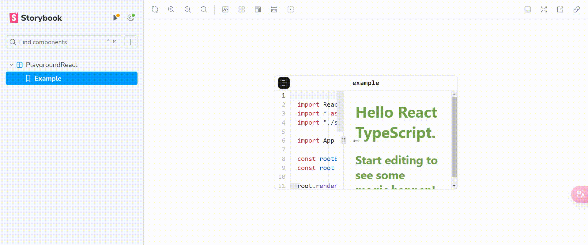

# Playground

Support running react code in the browser



> [!NOTE]
> This is a testing phase, please do not use it in production environment.  
> You are welcome to use it and submit lssues after `tag:0.1.0`

## Playground React

React components that give you the power of editable playground that run in the browser.

```shell
npm i @xqcc/playground-react
```

```jsx
import { Playground } from "@xqcc/playground-react";
import "@xqcc/playground-react/style.css";

<Playground template="react" name="your want name" />;
```
